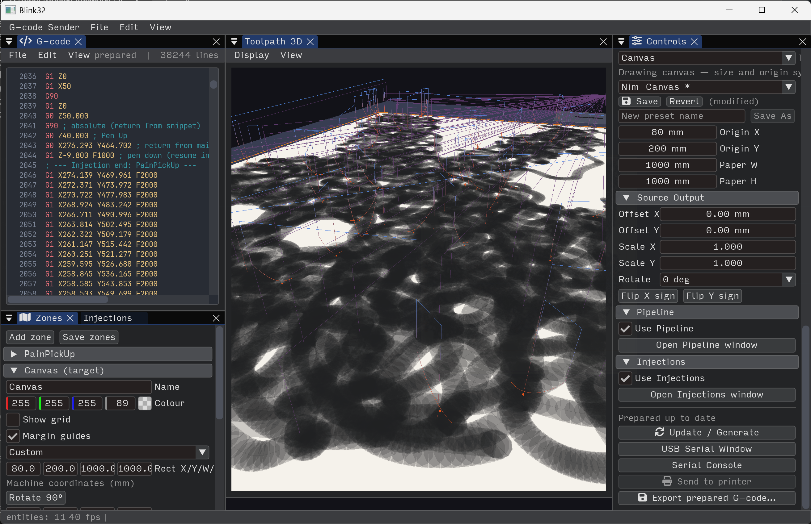

# ofxPlotterKit



Optional UI kit for [ofxPlotter](https://github.com/ofxyz/ofxPlotter): reusable
Dear ImGui windows and panels for plotter workflows.

> Stable ImGui docking ids live in `kit/PlotterKitUiIds.h` 

## Windows

### Registerable (`plotter::kit::registerWindow`)

These expose `name()` / `isVisible()` / `draw(bool&)`:

- `plotter::kit::PlotterPrintPreviewPanel` — G-code print preview: FBO / ImGui
  viewport, transport, G0 travel overlay, companion actions. Use standalone
  `draw()` / `registerWindow`, or embed via `drawScene()` / `drawHeader()` in a
  viewport or main 2D view.

- `plotter::kit::PlotterZonesPanel` — machine zone editor/inspector. Registry
  and selection via setters/callbacks. Optional `setImGuiWindowTitle`.

- `plotter::kit::PlotterPipelinePanel` — post-processor chain editor
  (`plotproc::PlotPipeline`) with optional last-run report and preset footer.
  Default Begin title: `Pipeline###plotter_kit.pipeline`.

- `plotter::kit::PlotterInjectionsPanel` — injection rules (interval / at start /
  at end), snippet catalog, reorderable list. Default title:
  `Injections###plotter_kit.injections`. Use `setPenZProviders` for live pen Z.

- `plotter::kit::PlotterPlaybackPanel` — toolpath playhead / scrub window with
  G-code line sync callbacks. Default title: `Playback###plotter_kit.playback`.

- `plotter::kit::PlotterJogWindow` — manual XY/Z jog, pen up/down, feed override,
  pause/stop, and safe home.

- `plotter::kit::PlotterSerialWindow` — use `registerSerialWindows` for **USB Serial**
  + **Serial Console** (or `registerWindow` for both with shared opts).

### Host-mounted panels

- `plotter::kit::GcodeGeneratorPanel` — **Generator** window (`draw(title, visible)`).
  Title id: `Generator###plotter_kit.gcode_gen`.

- `plotter::kit::Toolpath3DView` — 3D toolpath viewport via
  `Runtime::addViewportWindow("Toolpath 3D")` from `setup()`.

### Supporting (not standalone windows)

- `plotter::kit::GcodeExportSession` — async prepare/export cache.
- `plotter::kit::PlotterSnippetCatalog` — built-in + user snippets.
- `plotter::kit::PlotterEditorToolbar`, document/project helpers, presets.

```cpp
#include "ofxPlotterKit.h"

plotter::kit::PlotterJogWindow jogWindow;
jogWindow.setEngine(&plotDoc);
jogWindow.setSender(&sender);
jogWindow.setPrefs(&machinePrefs);

plotter::kit::PlotterSerialWindow serialWindow;
serialWindow.setSender(&sender);
serialWindow.setPrefs(&prefs);
serialWindow.refreshDeviceList();
serialWindow.syncSelectionFromPrefs();

plotter::kit::registerWindow(ofkitty::runtime(), jogWindow);
plotter::kit::registerSerialWindows(ofkitty::runtime(), serialWindow);
plotter::kit::registerWindow(ofkitty::runtime(), pipelinePanel);
plotter::kit::registerWindow(ofkitty::runtime(), injectionsPanel);
```

## Dependencies

`ofxPlotter`, `ofxGrbl`, `ofxKit`, `ofxImGuiTextEdit`
